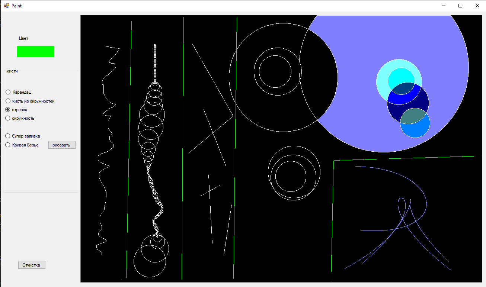

# Nano paint

---
## Project description

The task of the project is to create an application with the ability to draw. Brushes are used for drawing:
- A pen
- Is a brush made of circles with a dynamic size depending on the speed of movement
- Segment
- Bucket
- Bezier curve

The application also allows you to choose the color of the brush and clean the screen.

## Example of execution

## Technologies

- C# WinForms

## Useful tags
 
- Bezier approximation

## About the project

- developer: Kaleev Egor
- development date: 2019
- reason for development: computer graphics discipline

 
